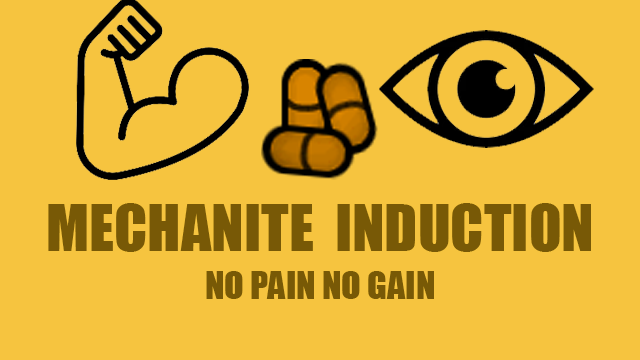
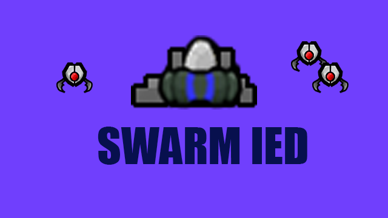
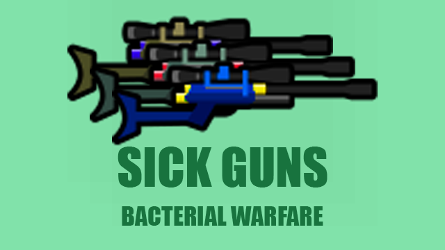

# RimWorld Mods
Here you can find the mods I've made for the game RimWorld by Ludeon Studios  
To install, drop the folders in the \Rimworld\Mods directory, then enable them in the mod options on the main menu.   
___
  
Versions: 1.3, 1.4  
**Adds pills that induce mutated Sensory or Fibrous mechanites in the host. These are mechanite diseases that cannot be outright cured, but provide enhanced physical abilities in addition to painful side effects.**  
Includes 2 mechanite pills can be crafted at a drug lab with 2 components and 2 neutroamine.  
Mechanite dieases can not be cured and must go away on their own, but the pain and severity can be decreased with high quality medicine and a skilled doctor.  

___
  
Versions: 1.3
This mod fixes a small bug in vanilla where installing dentures causes the pawn to also lose their tongue, causing an unintended -15 "Disfigured" social debuff. This happens because the tongue is considered 'part' of the jaw, so when the jaw is removed, the tongue is removed too, but the dentures do not provide a replacement tongue. This mod changes how dentures are added so the tongue is preserved.   
Also incudes a patch for the popular mod FSF Vanilla Bionics Expansion, providing the same fix for bionic and archotech jaws. Be sure to place Denture Fix below FSF Bionics in the mod load order.
___
  
Versions: 1.3  
**This mod has been merged into the main [Android Tiers 1.4](https://github.com/RWDevathon/Android-Tiers-Reforged/) rework!**  
Adds the ability to turn Swarm shell mortars from Android Tiers into IED traps.  
Requires [Android Tiers](https://github.com/Atla55/Android-Tiers-Core)  

___
  
Versions: 1.3
**Adds a set of dart guns that can inflict Plague, Flu, or Infection on the target.**  
Includes 3 new guns with unique dart gun texture, sound, and projectile.  
Dart guns can be crafted at a machining table with 30 steel and 2 components.  

___
  
Versions: 1.3
**Adds a very wasteful and slow method of smelting steel slag that is available regardless of research level.**  
Provides a very early way to get steel, intended for maps with zero resources, such as sea ice or propane lakes (Alpha Biomes), where the only source of steel is space debris.    Since vanilla smelting requires a research bench made of steel, it can be impossible to complete the initial research. Primitive smelting takes three times as long, and yields 1/3 of the steel produced by normal smelters, but it's better than nothing.  
